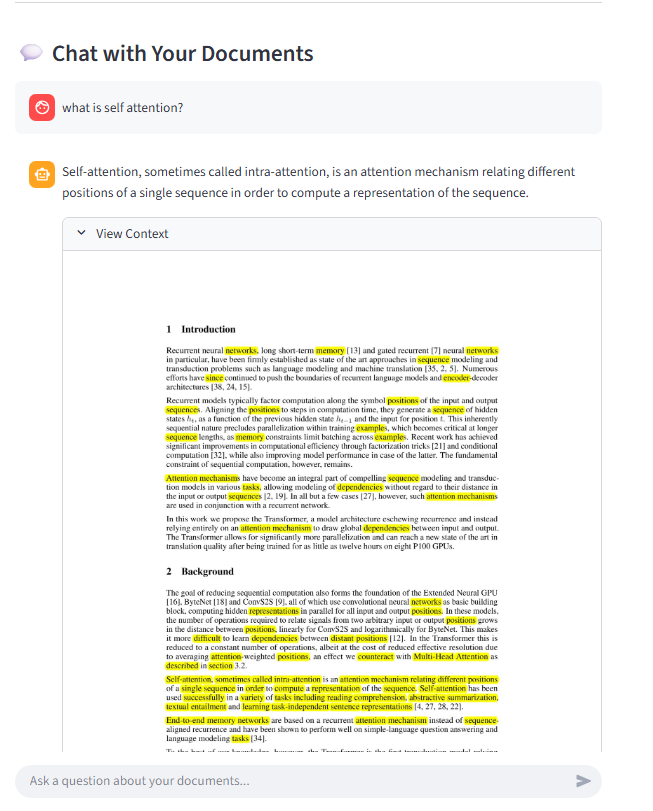
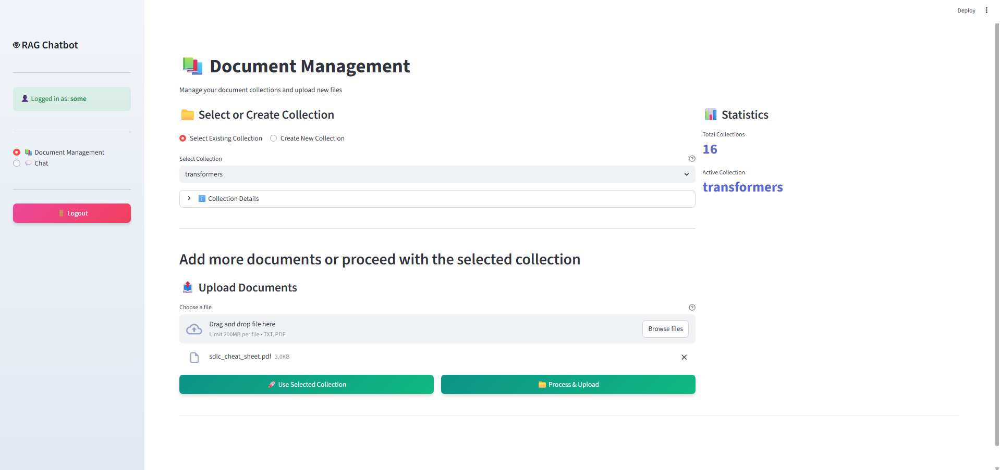
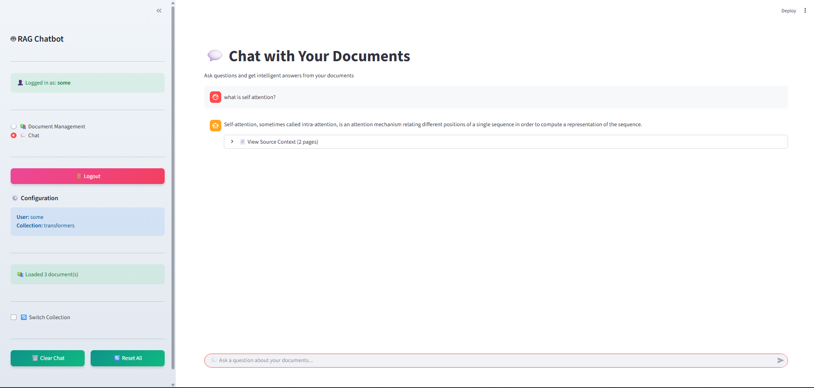

# 🧠 Hybrid RAG System with RRF Fusion + Visual PDF Context

This repository implements a **next-generation Retrieval-Augmented Generation (RAG)** system that fuses **multiple retrieval techniques** using **Reciprocal Rank Fusion (RRF)** — and takes it a step further by **returning the exact source PDF pages as annotated images**, with **retrieved chunks visually highlighted** for transparency and trust.

Built with **Streamlit** for an interactive interface.

---

## 🚀 Key Features

### 🧩 Multi-Modal, Multi-Strategy Retrieval
Your query is processed across multiple retrievers:
- **Sparse** (BM25 or TF-IDF)
- **Dense** (embedding-based retrieval)
- **Hierarchical (Parent–Child)** retrieval
- **ANN (Approximate Nearest Neighbors)** for high-speed dense search
- **SPLADE** for hybrid sparse–dense embeddings
- **HyDE (Hypothetical Document Embeddings)** for query expansion
- **Reranking** for semantic refinement

All retrievals are fused using **Reciprocal Rank Fusion (RRF)** for stable, robust ranking.

---

### 🧮 Reciprocal Rank Fusion (RRF)
**RRF** combines ranked results from multiple retrievers as:


`RRF(d) = sum_{r in R} 1 / (k + rank_r(d))`

Where:
- `R` = set of retrievers  
- `rank_r(d)` = rank of document `d` in retriever `r`  
- `k` = small constant (default = 60)

This ensures consistent performance even if individual retrievers underperform for specific queries.

---

### 🧠 Reranking
After fusion, results are **reranked** using a semantic reranker (Cohere / cross-encoder model) to improve contextual relevance between query and retrieved passages.

---

### 📄 Visual PDF Context (Explainability)
A standout feature of this system:

> For every answer, the retrieved context is displayed as **actual PDF pages rendered as images**, with **retrieved text chunks highlighted** and **annotated** directly on the page.

This provides:
- 🔍 **Transparency** — verify the exact source
- 🖋️ **Explainability** — see how the model derived its context
- 📚 **Debugging aid** — visualize chunk boundaries and relevance

Example output:

-

---

## ⚙️ Setup Instructions

### 1️⃣ Clone the Repository
```bash
git clone <your-repo-url>
cd <your-repo-folder>
```

2️⃣ Create a Virtual Environment
```bash
python -m venv venv
source venv/bin/activate      # Linux/Mac
venv\Scripts\activate         # Windows
```

3️⃣ Install Dependencies
```bash
pip install -r requirements.txt
```

4️⃣ Create the .env File

In your project root, create a .env file with the following contents:

```bash
GEMINI_API_KEY = ''
MILVUS_URL = ''
OLLAMA_API_ADDRESS = ''
COHERE_API_KEY = ''
PATH_TO_CHROMA_VEC_STORE = ''
GOOGLE_API_KEY = ''
```

⚠️ Make sure all keys and paths are valid before running the app.

5️⃣ Run the App
```bash
streamlit run main.py
```

Access the interface at:

http://localhost:8501

🔍 Retrieval Flow

- User enters a query

- Query expanded via HyDE

- Parallel retrieval from multiple retrievers (sparse, dense, hierarchical, SPLADE, ANN, etc.)

- RRF combines ranked results

- Cohere Reranker refines final ordering

- PDF Annotator retrieves original PDF pages and highlights matched chunks

Streamlit displays:




## 🧪 Tech Stack

| **Component** | **Technology** |
|----------------|----------------|
| **Frontend** | Streamlit |
| **Backend** | Python + LangChain |
| **Vector Store** | Milvus, Chroma |
| **Reranker** | Cohere Rerank API |
| **LLMs** | Gemini, Ollama, Cohere |
| **Query Expansion** | HyDE |
| **Visualization** | PyMuPDF / Pillow |

---

## 🧠 Future Enhancements

- Cross-encoder reranker fine-tuning  
- Confidence-based highlight coloring  
- Session-level retrieval caching  
- Automatic PDF summarization  

---

## 💡 Acknowledgements

Built with the help of:
- [LangChain](https://www.langchain.com/)  
- [Cohere](https://docs.cohere.com/)  
- [Milvus](https://milvus.io/)  
- [Chroma](https://www.trychroma.com/)  
- [Streamlit](https://streamlit.io/)
